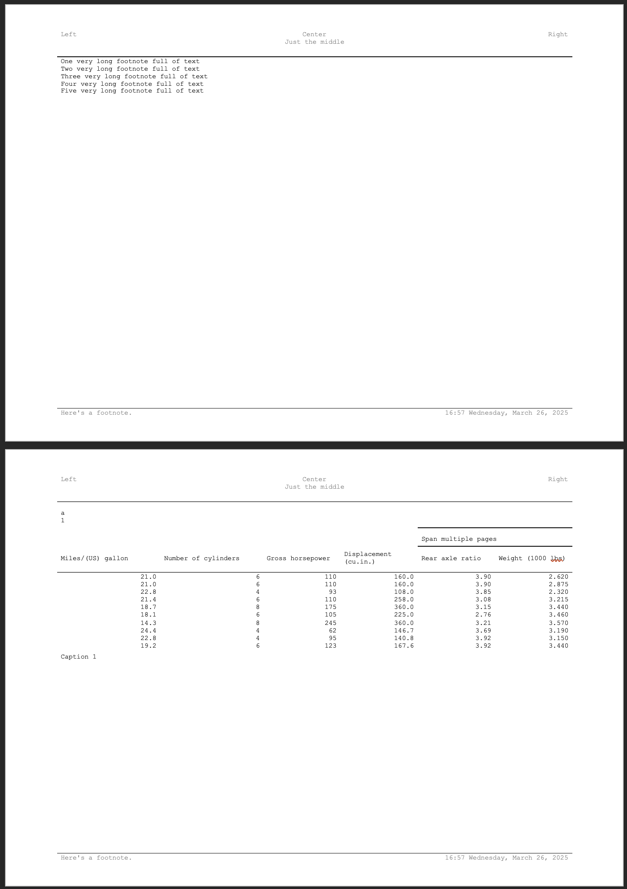

<!-- README.md is generated from README.Rmd. Please edit that file -->

```{r, include = FALSE}
knitr::opts_chunk$set(
  collapse = TRUE,
  comment = "#>",
  fig.path = "man/figures/README-",
  out.width = "100%"
)
```

# **clinify**

<!-- badges: start -->
<!-- badges: end -->

**clinify** is direct extension of the [**flextable**](https://davidgohel.github.io/flextable/) and [**officer**](https://davidgohel.github.io/officer/) packages, aimed at supplementing some functionality and simplifying some common tasks in the creation of clinical tables, listings and figures. 


## Installation

You can install the development version of **clinify** like so:

```{r, eval=FALSE}
# Install the development version:
devtools::install_github("https://github.com/atorus-research/clinify.git", ref="development")
```

## Motivation

There's a large assortment of table packages available, and there are many that are specifically catered to clinical reporting. For many organizations, one of these packages may very well be a great choice, but there are a couple of key motivators we've found that lead drove us to start writing **clinify**:

- Clinical output standards likely exist within an organization, and changing those standards may not be an option
- It's very likely that certain outputs will require that you deviate from those standards, so flexibility it necessary, sometimes in highly nuanced ways
- Organizations like Contract Research Organizations (CROs) may have to adapt to multiple clients' reporting standards, which likely don't look the same
- Regardless of the situation, reuse and repeatability of a given configuration is critical, and changes in configuration must be easily implemented. 

Instead of building a new package from the ground up, **clinify** aims to extend what we see as a best choice for the situation at hand, adding new functionality where necessary and streamlining common tasks to make them more efficient for programmers to implement. We chose **flextable** for a two key reasons:

- **flextable** already offers most of the functionality that we're looking for, particularly with the pairing of **officer**. For example, word documents have to be a first class priority of output support. 
- While creating a table is the focus, the output tends to be more than just a table. We need the capability to modify the underlying document as a whole, which is another place that **officer** is truly necessary.

## Design Philosophy 

Here are some key principles we're using in building **clinify**:

- **clinify** objects should inherit from an underlying **flextable** or **officer** object
- **clinify** functionality must not interfere with **flextable** or **officer** functionality, i.e. **flextable** or **officer** functions called should operate without error. 

## Example

Here's a basic example of some of clinify's benefit in action

```{r}
library(clinify)
# Mock some data
dat <- mtcars
dat['page'] <- c(
  rep(1, 10),
  rep(2, 10),
  rep(3, 10),
  c(4, 4)
)
dat2 <- rbind(dat, dat)
dat2['groups'] <- c(
  rep('a', 32),
  rep('b', 32)
)

# Create a basic table
ct <- clintable(dat2) |> 
  # Break pages by the "page" variable
  clin_page_by('page') |> 
  # Add header lines using the "groups" variable
  clin_group_by('groups') |> 
  # For overflowing columns, alternate pages with 
  # fixed variables for each page
  clin_alt_pages(
    key_cols = c('mpg', 'cyl', 'hp'),
    col_groups = list(
      c('disp', 'drat', 'wt'),
      c('qsec', 'vs', 'am'),
      c('gear', 'carb')
    ) 
  ) |> 
  # Apply column widths as a proportion of the total page
  # For alternating pages, the proportion allocated to key columns
  # is carried to each page group
  clin_col_widths(mpg = .2, cyl=.2, disp=.15, vs=.15) |>
  # Add titles here is using new_header_footer to allow flextable functions
  # to customize the titles block
  clin_add_titles(
    ft = new_title_footnote(
        list(
          c("Left", "Center", "Right"),
          c("Just the middle")
        ),
        "titles"
      )
  ) |> 
  clin_add_footnotes(
    ft = new_title_footnote(
      list(
        c(
          "Here's a footnote.", 
          format(Sys.time(), "%H:%M %A, %B %d, %Y")
        )
      ),
      "footnote"
    )
  )

# Print pages (by default 3 pages) to the viewer of the IDE
print(ct)
```

Built of {flextable} and {officer}, you can then write the table out to a docx file.

```{r write_table}
# Write the table out to docx
write_clintable(ct, "demo_table.docx")
```

<p align="center"></p>