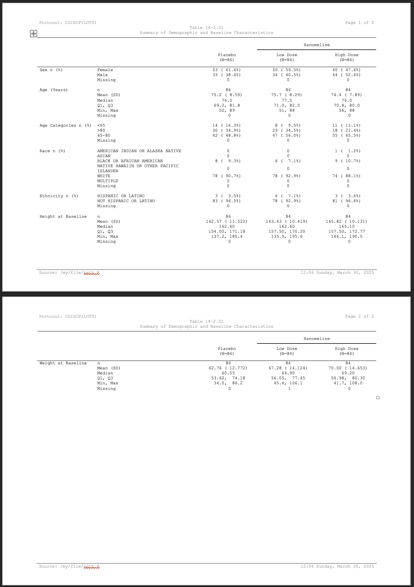

```{r, include = FALSE}
knitr::opts_chunk$set(
  collapse = TRUE,
  comment = "#>"
)
```

This vignette walks through a program in a fuller context. Here we're going to create a simple demographics table.

First we'll start by preparing the data. We'll use our other package {Tplyr} to take care of the summaries. 

```{r dataprep}
library(clinify)
library(Tplyr)
library(dplyr)

tplyr_adsl <- tplyr_adsl |>
  mutate(
    SEX = recode(SEX, M = "Male", F = "Female"),
    RACE = factor(RACE, c(
      "AMERICAN INDIAN OR ALASKA NATIVE", "ASIAN", "BLACK OR AFRICAN AMERICAN",
      "NATIVE HAWAIIN OR OTHER PACIFIC ISLANDER", "WHITE", "MULTIPLE"
    ))
  )

t <- tplyr_table(tplyr_adsl, TRT01P) |>
  add_layer(
    group_count(SEX, by = "Sex n (%)") |>
      set_missing_count(f_str("xx", n), Missing = NA, denom_ignore = TRUE)
  ) |>
  add_layer(
    group_desc(AGE, by = "Age (Years)")
  ) |>
  add_layer(
    group_count(AGEGR1, by = "Age Categories n (%)") |>
      set_missing_count(f_str("xx", n), Missing = NA, denom_ignore = TRUE)
  ) |>
  add_layer(
    group_count(RACE, by = "Race n (%)") |>
      set_missing_count(f_str("xx", n), Missing = NA, denom_ignore = TRUE) |>
      set_order_count_method("byfactor")
  ) |>
  add_layer(
    group_count(ETHNIC, by = "Ethnicity n (%)") |>
      set_missing_count(f_str("xx", n), Missing = NA, denom_ignore = TRUE)
  ) |>
  add_layer(
    group_desc(HEIGHTBL, by = "Height at Baseline")
  ) |>
  add_layer(
    group_desc(WEIGHTBL, by = "Weight at Baseline")
  )

# Apply some conditional formatting for blanking out 0's.
dat <- build(t) |>
  mutate(
    across(
      starts_with("var"),
      ~ if_else(
        ord_layer_index %in% c(1, 3:5),
        apply_conditional_format(
          string = .,
          format_group = 2,
          condition = x == 0,
          replacement = ""
        ),
        .
      )
    )
  )

# Sort all the row values out, add row masks and breaks
dat <- dat |>
  arrange(ord_layer_index, ord_layer_1, ord_layer_2) |>
  apply_row_masks(row_breaks = TRUE) |>
  select(
    starts_with("row_label"), var1_Placebo, `var1_Xanomeline Low Dose`,
    `var1_Xanomeline High Dose`, ord_layer_index
  )

# Grab the header Ns for column header help
header_n <- t$header_n$n
names(header_n) <- t$header_n$TRT01P
```

Great - our data are presentation ready now. Using **{clinify}** we'll get everything ready. Looking at some of these sections:

- We use `clin_auto_page()` to let Word figure out page breaks for us.
- Column headers are set using `clin_column_headers()`. We grabbed our header N's from {Tplyr} and inserted them here.
- We want our headers and parts of the body center aligned. Remember, we can use {flextable} functions directly on the `clintable` to do this.
- Column widths are set using `clin_col_widths()` by using a proportion of the total desired table width. 
- Lastly we'll add our titles and footnotes. We're putting current and total pages in the top right of our titles. Given the default styling functions in **{clinify}**, which you can override yourself, page numbers are auto detected by using the strings `{PAGE}` and `{NUMPAGES}`.


```{r style}
ct <- clintable(dat) |>
  clin_auto_page("ord_layer_index") |>
  clin_column_headers(
    row_label1 = "",
    row_label2 = "",
    var1_Placebo = sprintf("Placebo\n(N=%s)", header_n["Placebo"]),
    `var1_Xanomeline Low Dose` = c("Xanomeline", sprintf("Low Dose\n(N=%s)", header_n["Xanomeline Low Dose"])),
    `var1_Xanomeline High Dose` = c("Xanomeline", sprintf("High Dose\n(N=%s)", header_n["Xanomeline High Dose"]))
  ) |>
  flextable::align(align = "center", part = "header") |>
  flextable::align(j = c("var1_Placebo", "var1_Xanomeline Low Dose", "var1_Xanomeline High Dose"), align = "center") |>
  clin_col_widths(
    row_label1 = .17, row_label2 = .3, var1_Placebo = .176,
    `var1_Xanomeline Low Dose` = .176, `var1_Xanomeline High Dose` = .176
  ) |>
  # Add titles here is using new_header_footer to allow flextable functions
  # to customize the titles block
  clin_add_titles(
    list(
      # We'll add tools to automate paging
      c("Protocol: CDISCPILOT01", "Page {PAGE} of {NUMPAGES}"),
      c("Table 14-2.01"),
      c("Summary of Demographic and Baseline Characteristics")
    )
  ) |>
  clin_add_footnotes(
    list(
      c(
        "Source: /my/file/path.R",
        format(Sys.time(), "%H:%M %A, %B %d, %Y")
      )
    )
  )

print(ct)
```

With everything ready to go, we can write our table out to its destination using `write_clintable()`.

```{r, eval=FALSE}
write_clintable(ct, "demo_table.docx")
```

<p align="center"></p>
