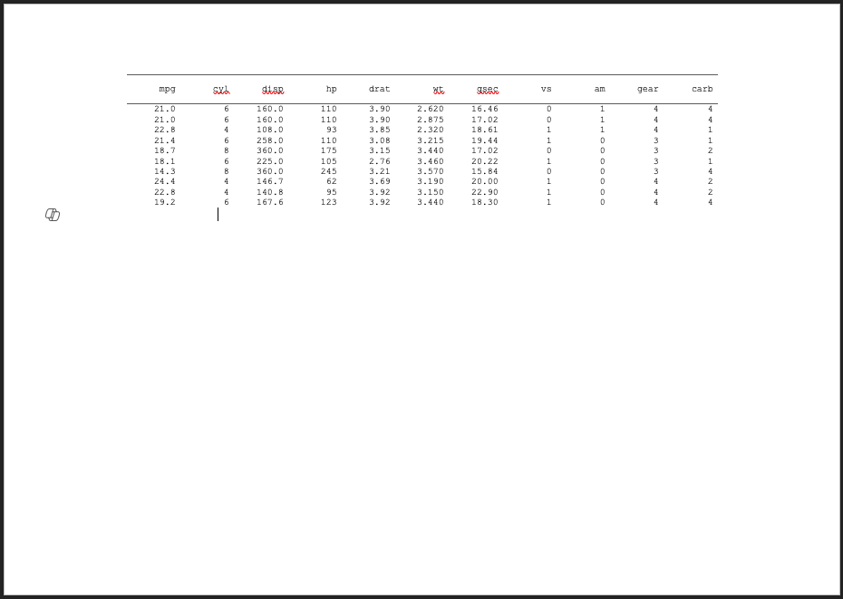
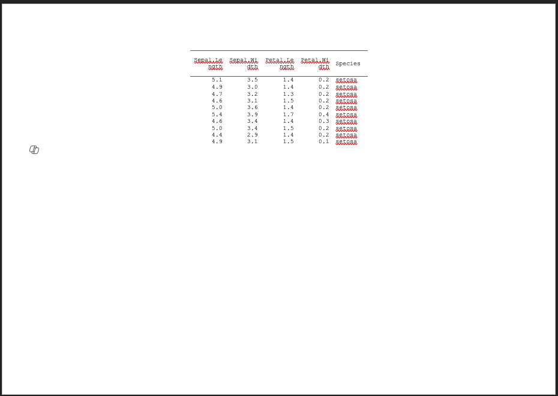
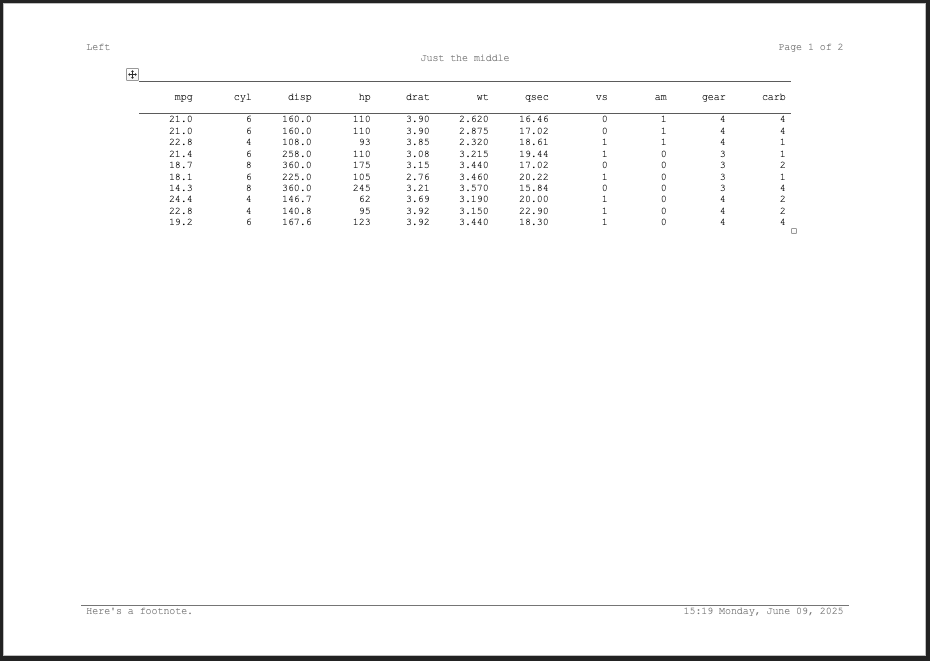
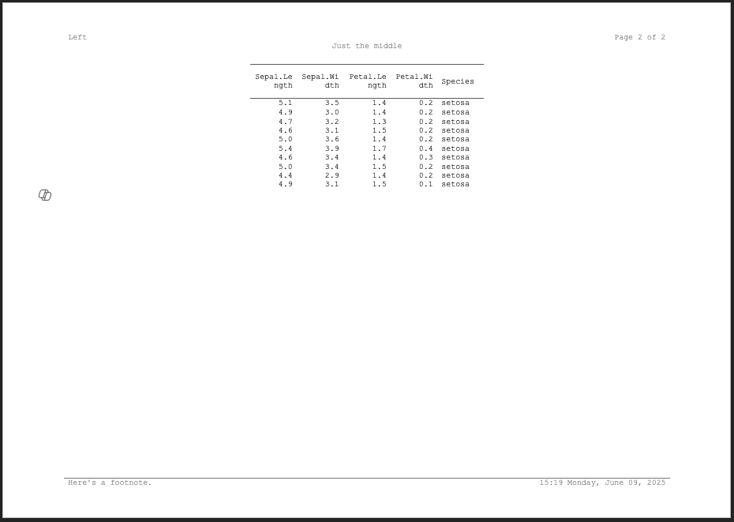

```{r, include = FALSE}
knitr::opts_chunk$set(
  collapse = TRUE,
  comment = "#>"
)
```

In most simple cases once you generate a `clintable` object and style it, you can just write it to disk. To do this, you can use the function `write_clindoc()`. 

```{r setup, eval=FALSE}
library(clinify)

ct <- clintable(mtcars)
write_clindoc(ct, file = tempfile(fileext = ".docx"))
```

That said, not all cases are simple. The general flow of writing out a table using clinify looks like this:

<p align="center"></p>

When you supply a `clintable` into `write_clindoc()`, the conversion into a `clindoc` object happens for you. But you can also create a clindoc on your own.

```{r, eval=FALSE}
library(clinify)

ct <- clintable(mtcars)

doc <- clindoc(ct)

write_clindoc(doc, file = tempfile(fileext = ".docx"))
```

In normal cases, this isn't really necessary and converting the object yourself doesn't add any benefit. The primary use case for this is for rare circumstances where you may have tables that require different column headers for different sections of data. Consider the following:

```{r, eval=FALSE}
ct1 <- clintable(head(mtcars, 10))
ct2 <- clintable(head(iris, 10))

doc <- clindoc(ct1, ct2)

write_clindoc(doc, file = tempfile(fileext = ".docx"))
```

<p align="center"></p>

<p align="center"></p>

This can alternatively be passed as a list of `clintable` objects instead of different arguments, which is much more convenient if you're generating tables using `lapply()` or {purrr}  

```{r, eval=FALSE}
ct1 <- clintable(head(mtcars, 10))
ct2 <- clintable(head(iris, 10))

doc <- clindoc(list(ct1, ct2))

write_clindoc(doc, file = tempfile(fileext = ".docx"))
```

When creating tables this way, titles and footnotes should be applied directly to the `clindoc` object using `clin_add_title()`, `clin_add_footnote()`, or `clin_add_footnote_page()`. Title and footnote information on the individual `clintable` objects will be ignored. We handle it this way for a few reasons:

- It would be tedious and redundant to apply the same titles and footnotes to each individual table
- Within the word document, titles and footnotes are applied to the default section of the document. They're specified once and then word applies them to each page.
- From a user perspective, taking them from one single table, for example, the first of the list, would mean specifying one table different than the rest - which would be a clunky user interface.

As such, the `clin_add_title()`, `clin_add_footnote()`, and `clin_add_footnote_page()` functions work on `clindoc` objects identically to a `clintable`.

```{r, eval=FALSE}
tables <- lapply(list(mtcars, iris), \(x) clintable(head(x, 10)))

doc <- clindoc(tables) |>
  clin_add_titles(
    list(
      c("Left", "Page {PAGE} of {NUMPAGES}"),
      c("Just the middle")
    )
  ) |>
  clin_add_footnotes(
    list(
      c(
        "Here's a footnote.",
        format(Sys.time(), "%H:%M %A, %B %d, %Y")
      )
    )
  )

write_clindoc(doc, file = tempfile(fileext = ".docx"))
```

<p align="center"></p>

<p align="center"></p>